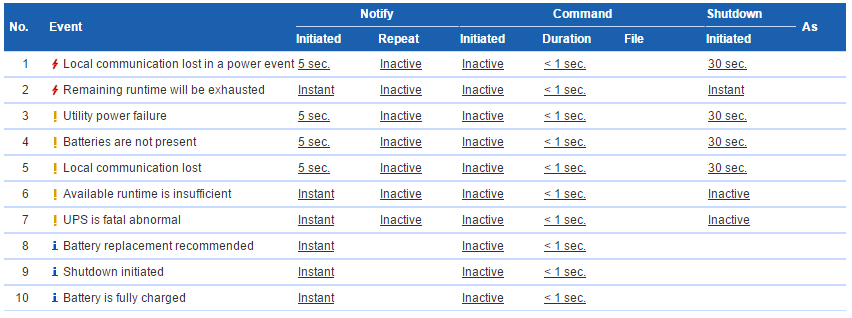

UPS
====

+-------------------+--------------------+
| **Networking**                         |
+-------------------+--------------------+
| Hostname          | ups                |
+-------------------+--------------------+
| IP                | 10.0.0.8           |
+-------------------+--------------------+
| Virtual Machine   | ups                |
+-------------------+--------------------+
| **Software**                           |
+-------------------+--------------------+
| Version           | Agent 3.2.3        |
+-------------------+--------------------+
| Last Updated      | May 2017           |
+-------------------+--------------------+
| **Hardware**                           |
+-------------------+--------------------+
| CPU               | 1                  |
+-------------------+--------------------+
| Memory            | 1GB                |
+-------------------+--------------------+
| Network           | Admin              |
+-------------------+--------------------+
| Storage           | 16GB (SSD)         |
+-------------------+--------------------+
| USB Device        | Cyber Power System |
+-------------------+--------------------+

CyberPower PFC Sinewave Series 1300Va 780W UPS.

Must use the Virtual Appliance (PowerPanel Business Edition Agent) as it has the ability to shutdown ESXi. The Linux and Windows version does not.

Warranty
---------
Comes with 2 years advance replacement including international batteries

Warranty is from 17/06/2014 to 17/06/2016

PowerPanel Business Edition Agent
----------------------------------
The software which allows remote management of the UPS

* Alerts via email
* Shutdown, startup and reboot of UPS
* Shutdown of ESXi when power loss detected

Download Virtual Appliance from here: https://www.cyberpowersystems.com/product/software/powerpanel-business-edition-for-virtual-machines/

Login is admin:admin

Commands
---------

.. code-block:: none

  sudo service ppbed stop
  sudo service ppbed start

Shutdown Settings
------------------

