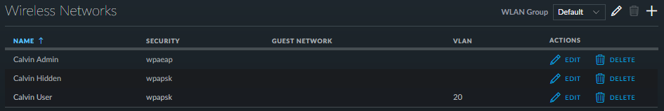

UniFi
======

+-------------------+-----------------------+
| **Networking**                            |
+-------------------+-----------------------+
| Hostname          | unifi                 |
+-------------------+-----------------------+
| IP                | 10.0.0.6              |
+-------------------+-----------------------+
| Virtual Machine   | unifi                 |
+-------------------+-----------------------+
| Website           | https://10.0.0.6:8443 |
+-------------------+-----------------------+
| **Software**                              |
+-------------------+-----------------------+
| Version           | 5.4.15                |
+-------------------+-----------------------+
| Last Updated      | May 2017              |
+-------------------+-----------------------+
| OS                | Ubuntu 16.04.2 LTS    |
+-------------------+-----------------------+
| **Hardware**                              |
+-------------------+-----------------------+
| CPU               | 1                     |
+-------------------+-----------------------+
| Memory            | 512MB                 |
+-------------------+-----------------------+
| Network           | Admin                 |
+-------------------+-----------------------+
| Storage           | 8GB (SSD)             |
+-------------------+-----------------------+

Installation
--------------
Deployed using https://github.com/calvinbui/ansible-unifi

Wireless Networks
------------------

RADIUS
-------

Add to RADIUS server first.

10.0.0.16:1812
